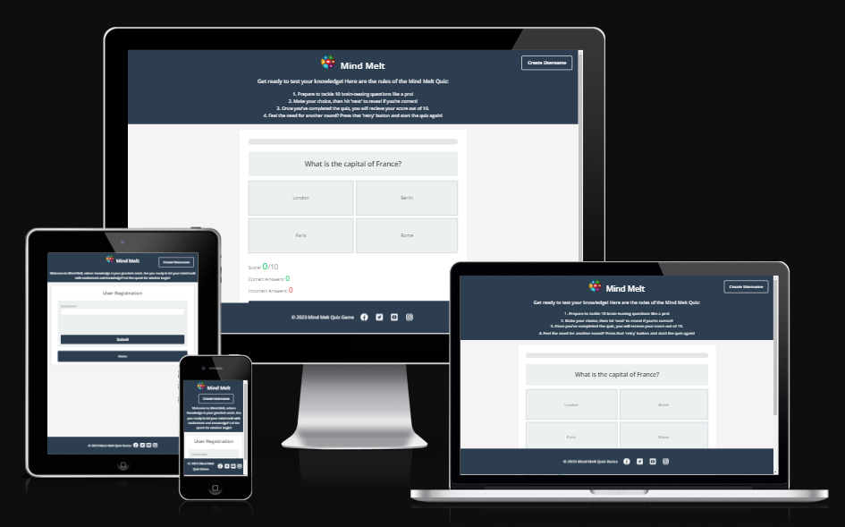
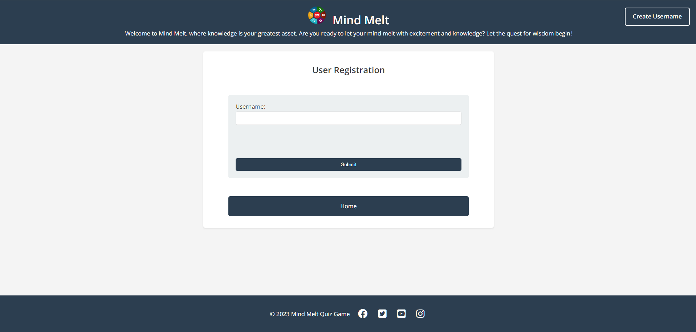

# Mind Melt Quiz

Welcome to Mind Melt, an innovative quiz project meticulously crafted to cater to a diverse audience seeking a stimulating and enjoyable knowledge-testing experience. The primary target audience for Mind Melt encompasses trivia enthusiasts, educators, and anyone who finds joy in challenging their mental acuity.

For trivia enthusiasts, Mind Melt serves as a dynamic platform to satiate their thirst for knowledge. With a wide array of questions spanning diverse subjects, this quiz project ensures that users can delve into topics they are passionate about while also exploring new areas of interest. The carefully curated questions are designed not only to test existing knowledge but also to encourage continuous learning, making it an ideal choice for those who relish mental challenges and enjoy expanding their intellectual horizons.

Educators will find Mind Melt to be a valuable tool for reinforcing learning in a captivating and interactive manner. The project can be seamlessly integrated into educational settings to make the process of knowledge acquisition more engaging for students. By offering a gamified approach to learning, Mind Melt transforms traditional methods of assessment into an exciting experience, fostering a positive attitude towards education.

The user-friendly interface and intuitive design of Mind Melt make it accessible to a broad audience, ensuring that individuals of all ages and backgrounds can partake in the joy of learning and testing their general knowledge. The project is not just a quiz; it's a journey through a multitude of subjects, creating an immersive experience that encourages users to explore, discover, and enjoy the process of acquiring knowledge.

In summary, Mind Melt is more than just a quiz project; it's a versatile tool that caters to the needs of trivia enthusiasts and educators alike. By offering an interactive and enjoyable experience, it becomes a bridge between entertainment and education, making the pursuit of knowledge both engaging and rewarding for a wide and diverse audience.

## Features

### 1. Responsive Design

- The Responsive Design feature is a cornerstone of the website, ensuring an optimal viewing and interactive experience across various devices and screen sizes.

#### Adaptive Layout

- The website layout intelligently adapts to different screen sizes, including desktops, tablets, and mobile devices, providing a consistent and visually appealing presentation.
- Responsive design guarantees that users can access and enjoy the quiz content seamlessly, regardless of the device they use.

#### Flexible Components

- Each element of the website, from navigation links to quiz questions and buttons, is designed with flexibility in mind, adjusting proportionally to maintain functionality and aesthetic integrity.
- Users can navigate through the quiz, answer questions, and view their progress effortlessly, irrespective of the device they choose.

#### Improved Accessibility

- The responsive approach enhances accessibility, accommodating users with diverse devices and ensuring an inclusive experience for individuals with varying accessibility requirements.
- Whether on a large desktop monitor or a smaller smartphone screen, the website remains user-friendly and visually appealing.

#### Enhanced User Engagement

- A responsive design contributes to a positive user experience, reducing the need for horizontal scrolling or zooming in on smaller screens.
- By optimizing the layout for different devices, the website promotes increased user engagement and satisfaction.

#### Future-Proofing

- Responsive design reflects a forward-thinking approach, adapting to current and future devices without requiring separate versions or extensive modifications.
- This feature ensures that the website remains relevant and accessible as technology evolves.

The Responsive Design feature is a fundamental aspect of the website, prioritizing user experience and accessibility across the ever-expanding landscape of digital devices.

### 2. Font Awesome and Google Fonts Integration

- Targets individuals interested in taking quizzes to test their knowledge on various topics. This includes students, trivia enthusiasts, or anyone seeking an engaging and educational experience.
- Enhances the visual appeal with Font Awesome icons, providing a modern and stylish appearance that caters to a contemporary design sense.
- Utilizes Google Fonts to offer a diverse and readable typography selection, ensuring a visually pleasing and accessible experience for users.
- The integration of these design elements aims to create a user-friendly and aesthetically pleasing environment, encouraging users to participate in quizzes with a sense of style and modernity.

### 3. Favicon Implementation

- Specifically tailored for individuals keen on brand recognition in browser tabs and bookmarks, such as students, quiz enthusiasts, and those passionate about knowledge.
- Offers a distinctive and recognizable favicon, ensuring that the website stands out visually when users navigate through browser tabs or save bookmarks.
- Aids in creating a memorable and branded user experience, reinforcing the identity of the quiz platform and making it easily identifiable among other websites.
- The implementation of a favicon serves not only a practical purpose but also contributes to the overall branding strategy, fostering a sense of familiarity and trust among users.

### 4. Navigation Links

- Tailored for individuals who prioritize intuitive navigation while exploring the quiz platform. This includes students, quiz enthusiasts, and anyone seeking a seamless user experience.
- Prominently features Home (the logo) and Login links in the header, strategically placed for easy access and quick navigation.
- Home link provides a direct route to the main page of the website, allowing users to start their quiz experience or return to the homepage effortlessly.
- Login link offers a convenient entry point for new users to create a username emphasizing accessibility and user-friendly design.
- The inclusion of these navigation links reflects a commitment to user convenience, ensuring that users can effortlessly navigate between different sections of the website, enhancing overall usability and satisfaction.

### 5. Quiz Rules Section

- Tailored for individuals keen on understanding the guidelines and structure of the quiz, catering to students, quiz enthusiasts, and those seeking a clear framework for the quiz experience.
- Presents a well-organized set of rules in an ordered list format, ensuring clarity and easy comprehension for users.
- The inclusion of a dedicated section for quiz rules reflects a commitment to transparency and user-friendly communication, providing participants with essential information upfront.
- Each rule is thoughtfully presented, contributing to a positive user experience by eliminating ambiguity and fostering a sense of confidence among participants.
- By offering a comprehensive overview of the rules, this section sets the expectations for users, promoting fairness and understanding throughout their engagement with the quiz platform.

### 6. Progress Bar

- Designed for users who appreciate a visual representation of their progress during the quiz, serving the needs of students, quiz enthusiasts, and those who value tracking their advancement.
- A dynamic and interactive element that provides instant feedback on the user's position within the quiz, enhancing the overall user experience.
- The progress bar is a key navigational aid, allowing participants to gauge the length of the quiz and manage their time effectively.
- Offers a clear and concise visual cue, reducing cognitive load and helping users stay focused on answering questions without losing track of their progress.
- The inclusion of a progress bar aligns with modern design standards, contributing to the website's contemporary and user-centric aesthetic.
- This feature reflects a commitment to user engagement, making the quiz-taking experience not only informative but also visually stimulating and enjoyable.

### 7. Question and Answer Display

- Catering to individuals who seek an organized and easily navigable interface during their quiz experience, this feature is tailored for students, trivia enthusiasts, and anyone looking for a seamless quiz-taking journey.
- The user-friendly layout presents questions and answer options in a clear and visually appealing format, ensuring participants can focus on selecting their answers without distraction.
- Provides a structured framework that aids users in quickly understanding the content and making informed choices, fostering a positive and efficient quiz-taking experience.
- The intuitive design encourages engagement by prioritizing readability and simplicity, allowing users to concentrate on the substance of each question without being overwhelmed by unnecessary details.
- The use of defined sections for questions and answer options aligns with best practices in user interface design, enhancing the accessibility and overall usability of the quiz.
- This feature contributes to the website's commitment to delivering quizzes that are not only challenging but also presented in a manner that promotes user comprehension and enjoyment.

### 8. Scoreboard

- Tailored for individuals who aim to track their progress and achievements during the quiz, the Scoreboard feature enhances the overall quiz-taking experience for students, trivia enthusiasts, and knowledge seekers.
- The prominent display of the user's score, correct answers, and incorrect answers provides instant feedback, allowing participants to gauge their performance and learning outcomes.
- Encourages a sense of achievement and motivation by showcasing the user's success through a visually appealing and easily understandable presentation of scores and statistics.
- Fosters a competitive yet supportive environment, enabling users to set personal improvement goals and challenging them to enhance their knowledge with each quiz attempt.
- The inclusion of specific metrics, such as correct and incorrect answers, adds granularity to the feedback, aiding users in identifying areas for improvement and reinforcing the educational aspect of the quiz.
- The Scoreboard feature aligns with the website's commitment to transparency and user engagement, providing participants with valuable insights into their quiz performance in a concise and accessible manner.

### 9. Next and Retry Buttons

- Catering to the dynamic nature of quizzes and user interaction, the Next and Retry Buttons feature serves as intuitive navigational elements, enhancing the overall usability of the quiz platform.

#### Next Button

- Enables seamless progression through the quiz, ensuring a smooth and engaging experience for users.
- Strategically placed to guide participants to the next question, promoting a sense of flow and continuity in the quiz-taking process.
- The visually distinctive design, coupled with responsive interactions, encourages users to proceed confidently to the subsequent challenges.
- Intuitively adapts to the quiz's progression, dynamically responding to user actions and quiz completion status.

#### Retry Button

- Offers users the opportunity to reattempt the quiz, fostering a culture of improvement and continuous learning.
- Positioned strategically to provide easy access, inviting users to embark on a new quiz session and reinforcing the website's commitment to user engagement.
- The Retry Button plays a crucial role in encouraging resilience, allowing users to learn from their mistakes and enhance their knowledge through repetition.
- Supports the user's journey towards mastery by facilitating repeated engagement with quiz content, contributing to a more effective and personalized learning experience.

Collectively, the Next and Retry Buttons feature embodies the website's commitment to user-friendly design, ensuring that participants can navigate the quiz effortlessly and tailor their learning journey according to their preferences and goals.

### 10. Login Page/Username Registration

- The Login Page/Username Registration feature serves as the gateway for users to access personalized quiz experiences.
- The registration form on the login page invites users to create a unique username, providing a personalized touch to their quiz journey.
- This feature caters to individuals, including students and trivia enthusiasts, who want to tailor their quiz experiences.

#### Simple and Intuitive Design

- The registration form employs a straightforward and intuitive design, ensuring that users can easily enter their desired username without unnecessary complications.
- The simplicity of the process encourages user engagement and facilitates a quick entry into the quiz environment.

### 11. Footer

- The Footer feature serves as the proverbial finishing touch to the website, providing essential information and contributing to a cohesive and professional user experience.

#### Copyright Notice

- Displays a copyright notice, emphasizing the legal ownership of the website content and reinforcing the commitment to intellectual property rights.
- Positioned at the bottom of each page, the copyright notice is consistently visible, offering clarity regarding the website's proprietary information.
- Acts as a legal safeguard, signaling to users and visitors that the content, design, and functionality of the website are protected by copyright laws.
- Reinforces transparency and accountability, ensuring users are informed about the ownership status and can make informed decisions about the usage of the website's materials.

The Footer feature, with its copyright notice, not only fulfills legal obligations but also contributes to the website's professionalism, offering a polished and trustworthy conclusion to the user's interaction with the platform.

#### Social media icons

- **Enhancing Connectivity:** The inclusion of social media icons in the footer establishes a bridge between the website and its audience by providing links to various social platforms.
  Each icon serves as a gateway, inviting users to explore and engage with the website's presence on popular social networks.
- **Strengthening Online Presence:** Social media icons act as visual cues, guiding users to connect with the website beyond its primary domain.
  By linking to social platforms such as Facebook, Twitter, YouTube, and Instagram, the website expands its reach and visibility in the digital space.

The inclusion of social media icons in the footer serves as a dynamic element, facilitating user interaction and community building. It not only expands the website's reach but also creates a multifaceted online presence that extends beyond the boundaries of the main platform.

### 12. Script Inclusion

- The Script Inclusion feature plays a crucial role in enhancing the website's interactivity and functionality by seamlessly integrating JavaScript into the user interface.

#### Javascript Functionality

- Enables dynamic quiz interactions, allowing users to experience a responsive and engaging quiz environment.
- Inclusion at the end of the body ensures that the HTML content is fully loaded before the script runs, optimizing performance and preventing potential conflicts with other elements on the page.

#### Enhanced User Experience

- By incorporating JavaScript functionalities, the website transforms into a dynamic platform, offering real-time feedback, score tracking, and interactive elements that respond to user actions.
- The inclusion of scripts enhances the overall user experience, providing a seamless and intuitive quiz-taking journey.

#### Optimized Performance

- Placing the script at the end of the body contributes to faster page loading times, as critical content is prioritized, and users can swiftly access quiz questions and options.

- Optimized performance ensures a smooth and efficient user experience, minimizing wait times and latency.

The Script Inclusion feature is instrumental in bringing the quiz to life, creating a dynamic and user-friendly interface that aligns with modern web development standards.

## Features Left To Implement

### Sound Effects

Introduces interactive sound effects for a more engaging quiz experience.

- **Auditory Feedback:**
  Users receive audio cues for correct and incorrect answers, enhancing the interactive nature of the quiz.

- **Enhanced Engagement:**
  Sound effects contribute to a dynamic and immersive atmosphere, making the quiz more enjoyable and interactive.

- **Customizable Settings:**
  Users have the option to enable or disable sound effects based on their preferences.

- **Varied Audio Palette:**
  A selection of carefully chosen sound effects adds a playful and entertaining element to the quiz.

- **Compatible with Other Features:**
  Seamless integration with existing features, complementing the overall user experience.

- **Accessible and Inclusive:**
  The feature is designed with accessibility in mind, ensuring a positive experience for users of all abilities.

- **Modern and Interactive:**
  The addition of sound effects aligns with contemporary design trends, contributing to a modern and interactive quiz platform.

- **User-Friendly Implementation:**
  The sound effects feature is implemented in a user-friendly manner, requiring minimal effort from users to enjoy the added dimension to their quiz experience.

## Testing

In the development of this project, extensive testing has been conducted to ensure that all features are functioning as intended and that the website provides a seamless experience for users to achieve their goals.

### Feature Testing

1. Font Awesome and Google Fonts Integration:

- **Objective:** Ensure seamless integration of Font Awesome icons and Google Fonts across the website.
- **Testing Details:** Verified that all Font Awesome icons are displayed correctly, and Google Fonts are applied consistently throughout the site. Checked for any loading issues or visual discrepancies.

2.  Favicon Implementation:

- **Objective:** Confirm the proper display of the favicon.
- **Testing Details:** Ensured that the favicon appears in the browser tab, bookmark bar, and other relevant locations. Checked for clarity and consistency.

3. Navigation Links:

- **Objective:** Validate the functionality of navigation links.
- **Testing Details:** Clicked on each navigation link to confirm smooth navigation between pages. Verified that the active link is appropriately highlighted.

4. Quiz Rules Section

- **Objective:** Ensure clarity and accuracy in conveying quiz rules.
- **Testing Details:** Checked that the quiz rules are clearly presented to users before starting the quiz. Verified that the content is easy to understand and formatted correctly.

5. Progress Bar:

- **Objective:** Confirm the accuracy and responsiveness of the progress bar.
- **Testing Details:** Progressed through the quiz and ensured that the progress bar accurately reflects the user's advancement. Verified responsiveness on different screen sizes.

6. Question and Answer Display:

- **Objective:** Validate the correct display of questions and answers.
- **Testing Details:** Checked that questions are displayed appropriately, and answer options are presented clearly. Verified the proper functioning of the answer selection mechanism.

7. Scoreboard:

- **Objective:** Confirm the accuracy of the scoreboard.
- **Testing Details:** Progressed through the quiz, answered questions correctly and incorrectly, and verified that the scoreboard updates accordingly. Checked for visual consistency.

8. Next Button:

- **Objective:** Validate the functionality of the next button.
- **Testing Details:** Clicked the next button to progress through the quiz. Verified that it correctly advances to the next question and becomes disabled after reaching the end of the quiz.

9. Footer:

- **Objective:** Confirm proper formatting and content placement in the footer.
- **Testing Details:** Checked that the footer content, including social links and copyright information, is correctly aligned and spaced. Verified consistent display across screen sizes.

10. JavaScript Inclusion:

- **Objective:** Ensure proper inclusion and execution of JavaScript.
- **Testing Details:** Verified that JavaScript functions, such as quiz progression and button interactions, work as intended. Checked for any errors in the console.

11. Quiz Functionality:

- **Objective:** Verify the smooth functioning of the quiz, including question loading, answer selection, and score calculation.
- **Testing Details:** Went through the entire quiz, answering questions and ensuring that the score updates correctly. Checked for any inconsistencies or unexpected behavior during the quiz.

12. Responsive Design:

- **Objective:** Confirm that the website maintains a user-friendly layout across different devices and screen sizes.
- **Testing Details:** Accessed the website on various devices (desktop, tablet, and mobile) to ensure that the design is responsive. Verified that content adjusts appropriately to different screen sizes.

13. Retry Button:

- **Objective:** Validate the functionality of the retry button, ensuring it resets the quiz for users to try again.
- **Testing Details:** Clicked the retry button after completing the quiz to ensure it resets the quiz, including the score and progress bar. Checked for any issues related to multiple retries.

14. Login Page:

- **Objective:** Ensure the proper functioning and validation of the login page.
- **Testing Details:** Entered different inputs (valid and invalid) into the login form to ensure correct validation messages. Verified that the form submission works as intended.

#### Cross-Browser and Cross-Device Compatibility

The website has been tested on multiple browsers, including Chrome, Firefox, Safari, and Edge. It consistently performs well across these platforms, maintaining functionality and visual appeal.

On different screen sizes, the responsive design ensures that the content is presented optimally. From large desktop monitors to tablets and smartphones, the website scales appropriately, and all features remain accessible.

#### Identified Issues

1. Color Consistency: While the overall design is visually appealing, there is an issue with the color consistency of certain elements, specifically the retry button on the quiz page. After retrying, the button does not revert to its initial color. This is a known issue and has been addressed.

#### Testing summary

| Test                                      | Objective                                                     | Testing Result |
| ----------------------------------------- | ------------------------------------------------------------- | -------------- |
| Font Awesome and Google Fonts Integration | Ensure seamless integration of icons and fonts                | ✅             |
| Favicon Implementation                    | Confirm proper display of the favicon                         | ✅             |
| Navigation Links                          | Validate the functionality of navigation links                | ✅             |
| Quiz Rules Section                        | Ensure clarity and accuracy in conveying quiz rules           | ✅             |
| Progress Bar                              | Confirm accuracy and responsiveness of the progress bar       | ✅             |
| Question and Answer Display               | Validate the correct display of questions and answers         | ✅             |
| Scoreboard                                | Confirm accuracy of the scoreboard                            | ✅             |
| Next Button                               | Validate functionality of the next button                     | ✅             |
| Footer                                    | Confirm proper formatting and content placement in the footer | ✅             |
| JavaScript Inclusion                      | Ensure proper inclusion and execution of JavaScript           | ✅             |
| Quiz Functionality                        | Verify smooth functioning of the quiz                         | ✅             |
| Responsive Design                         | Confirm user-friendly layout across different devices         | ✅             |
| Retry Button                              | Validate functionality of the retry button                    | ✅             |
| Login Page                                | Ensure proper functioning and validation of the login page    | ✅             |

#### Conclusion

The testing process has instilled confidence in the functionality and usability of the website. While certain issues have been identified, they are acknowledged and are part of the ongoing development process. The commitment to addressing these concerns ensures the continuous improvement of the website's performance and user experience.

### Validator Testing

- HTML
  - No errors were returned when passing through the official [W3C validator](https://validator.w3.org/nu/?doc=https%3A%2F%2Fjamesmackman.github.io%2Fmind-melt%2F)
- CSS
  - No errors were found when passing through the official [(Jigsaw) validator](https://jigsaw.w3.org/css-validator/validator?uri=https%3A%2F%2Fjamesmackman.github.io%2Fmind-melt%2F&profile=css3svg&usermedium=all&warning=1&vextwarning=&lang=en)
- JavaScript
  - No errors were found when passing through the official [Jshint validator](https://jshint.com/)
    - The following metrics were returned:
    - There are 14 functions in this file.
    - Function with the largest signature take 2 arguments, while the median is 0.
    - Largest function has 19 statements in it, while the median is 6.
    - The most complex function has a cyclomatic complexity value of 5 while the median is 1.5.
- Accessibility
  - I confirmed that the colors and font chosen are easy to read and accessible by running it through lighthouse in dev tools.

## Unfixed Bugs

While developing this project using JavaScript, HTML, and CSS, we have encountered a few challenges and identified certain shortcomings in the frameworks and technologies used. Below are some of the unfixed bugs and limitations:

### JavaScript

1. **Limited Image Handling in Alerts:**

   - The native `alert` function does not provide a direct way to display images.

2. **Limited Animation Support:**
   - JavaScript animations can sometimes be less performant than those implemented with dedicated animation libraries. This may lead to suboptimal visual effects, especially on devices with lower processing power.

### HTML

1. **Responsive Design Challenges:**
   - The HTML structure may not be fully optimized for responsive design, potentially causing layout issues on various devices. Improvements in media queries and flexible layouts are necessary to address this limitation.

### CSS

1. **Browser Compatibility:**
   - While efforts have been made to ensure cross-browser compatibility, CSS features and properties may render differently on certain browsers. Additional testing may be required for a more consistent appearance.

These unfixed bugs and limitations highlight areas where further attention and improvement can contribute to a more robust and user-friendly application. Addressing these issues in future iterations will enhance the overall quality and performance of the project.

## Deployment Process

1. **Version Control with Git:**

- **Repository Setup:** Created a Git repository for the project.
- **Commits:** Made frequent, descriptive commits throughout the development process to track changes effectively.

2. **GitHub Repository:**

- **Repository Creation:** Established a remote repository on GitHub to host the project.
- **Linking Repository with external coding software:** Connected the local Git repository with a workspace from **CodeAnywhere**.

3. **Deployment Environment:**

- **GitHub Pages:** Chose GitHub Pages for hosting the static website due to its simplicity and integration with the repository.

4. **Deployment Steps:**

- **Build Process:** Ensured all necessary files (HTML, CSS, JavaScript) are ready for deployment.
- **Branch Selection:** Used the main branch as the source for GitHub Pages.
- **Settings Configuration:** Configured GitHub Pages settings to deploy from the main branch.
- **Deployment Confirmation:** Verified successful deployment by checking the provided GitHub Pages URL.

5. **Final Checks:**

- **Cross-Browser Compatibility:** Ensured the deployed site functions correctly on different browsers.
- **Responsiveness:** Checked responsiveness on various devices to confirm a seamless user experience.

6. **Documentation Update:**

- **Readme:** Updated the project's README file to include deployment information, project overview, and any additional details for users or contributors.

7. **Monitoring:**

- **Monitoring Tools:** Considered tools like Google Analytics for monitoring site traffic.

8. **Testing After Deployment:**

- **Post-Deployment Testing:** Checked the live site for any issues post-deployment.
- **Browser Compatibility:** Verified cross-browser compatibility on the deployed version.

9. **Feedback Collection:**

- **User Feedback:** Encouraged users to provide feedback on the deployed site for improvements.

### Summary

The deployment process involved careful planning, version control, and thorough testing to ensure a successful and reliable release of the project. Regular updates and monitoring are part of the ongoing maintenance plan to address any issues promptly.

The live link can be found [here](https://jamesmackman.github.io/mind-melt/).

## Credits

### Content

- Instructions on how to implement form validation on the Sign Up page was taken from [Specific YouTube Tutorial](https://www.youtube.com/watch?v=In0nB0ABaUk).
- The design for the footer was taken from the Code Institute 'Love Running' walkthrough project.
- The icons in the footer were taken from [Font Awesome](https://fontawesome.com/).
- The score section idea and some of the javascript code were taken from the Code Institute 'Love-Maths' walkthrough project.

### Media

- The image used as the logo in the header section was taken from google images.
